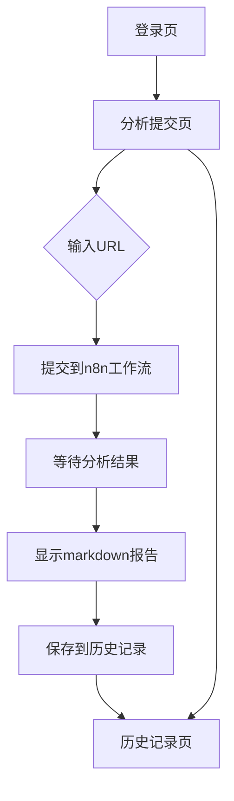

## 1. 产品概述
Polymarket事件分析平台是一个动态网址应用，允许用户输入Polymarket事件URL，通过n8n工作流进行分析，并返回markdown格式的分析报告。用户可以登录查看历史分析记录。

该平台为预测市场分析师和交易者提供自动化事件分析工具，提升研究效率。

## 2. 核心功能

### 2.1 用户角色
| 角色 | 注册方式 | 核心权限 |
|------|----------|----------|
| 普通用户 | 邮箱注册 | 提交URL分析、查看历史记录、管理个人资料 |

### 2.2 功能模块
Polymarket事件分析平台包含以下主要页面：
1. **登录/注册页**：用户身份验证、账号创建
2. **分析提交页**：URL输入、提交分析请求、显示分析结果
3. **历史记录页**：查看过往分析记录、重新查看报告

### 2.3 页面详情
| 页面名称 | 模块名称 | 功能描述 |
|----------|----------|----------|
| 登录/注册页 | 登录表单 | 输入邮箱密码进行身份验证 |
| 登录/注册页 | 注册表单 | 创建新账号，包含邮箱验证 |
| 分析提交页 | URL输入区 | 输入Polymarket事件URL，支持粘贴和验证 |
| 分析提交页 | 提交按钮 | 发送URL到n8n工作流进行处理 |
| 分析提交页 | 结果展示区 | 渲染并显示markdown格式的分析报告 |
| 分析提交页 | 状态指示器 | 显示分析进度和状态信息 |
| 历史记录页 | 记录列表 | 展示用户所有历史分析记录 |
| 历史记录页 | 搜索过滤 | 按时间、关键词筛选历史记录 |
| 历史记录页 | 报告查看器 | 重新打开并查看历史分析报告 |

## 3. 核心流程
用户操作流程：
1. 用户访问网站，首先进行登录或注册
2. 登录成功后进入分析提交页面
3. 在输入框中粘贴Polymarket事件URL
4. 点击提交按钮，系统将URL发送到n8n工作流
5. 等待工作流处理完成，接收markdown格式的分析报告
6. 报告自动保存到用户历史记录中
7. 用户可以在历史记录页面查看所有过往分析

## 4. 用户界面设计

### 4.1 设计风格
- **主色调**：深蓝色 (#1e40af) 体现专业性
- **辅助色**：浅灰色 (#f3f4f6) 用于背景和卡片
- **按钮样式**：圆角矩形，悬停效果，主要按钮使用主色调
- **字体**：系统默认字体，标题16-18px，正文14px
- **布局风格**：卡片式布局，顶部导航栏，响应式网格
- **图标风格**：使用简洁的线性图标

### 4.2 页面设计概览
| 页面名称 | 模块名称 | UI元素 |
|----------|----------|---------|
| 登录/注册页 | 表单区域 | 居中卡片布局，白色背景，圆角边框，阴影效果 |
| 分析提交页 | URL输入区 | 大文本输入框，占位符提示，输入验证反馈 |
| 分析提交页 | 结果展示区 | markdown渲染器，语法高亮，可滚动区域 |
| 历史记录页 | 记录列表 | 时间线布局，卡片式记录项，包含标题和时间 |

### 4.3 响应式设计
- 采用桌面优先设计策略
- 适配平板和手机屏幕
- 触摸友好的按钮和交互元素
- 移动端优化布局和字体大小