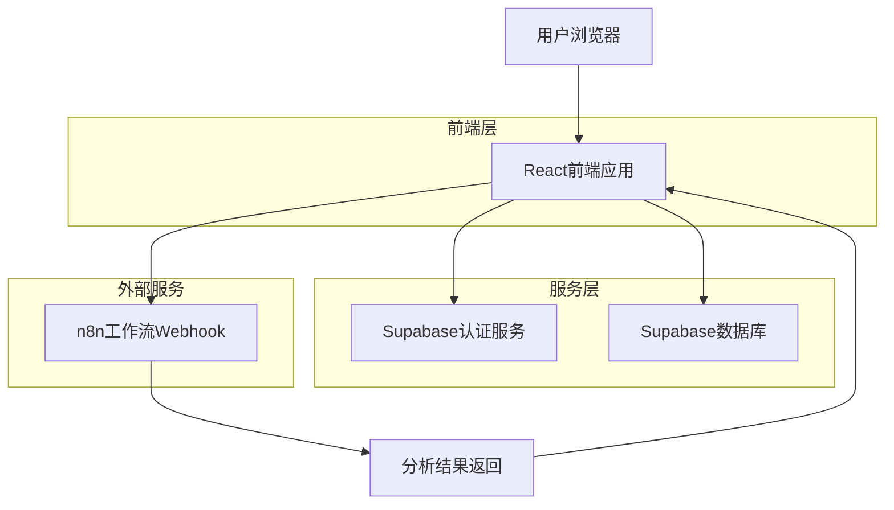
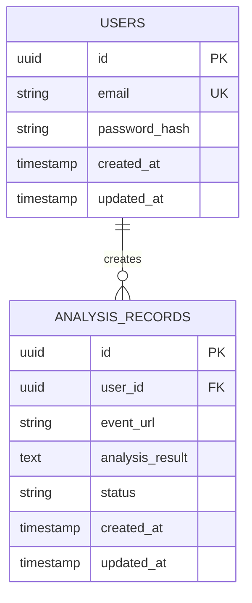

## 1. 架构设计



## 2. 技术描述
- 前端：React@18 + tailwindcss@3 + vite
- 初始化工具：vite-init
- 后端：Supabase（提供认证和数据库服务）
- 外部集成：n8n工作流Webhook

## 3. 路由定义
| 路由 | 用途 |
|-------|---------|
| /login | 登录页面，用户身份验证 |
| /register | 注册页面，创建新用户账号 |
| /analyze | 分析提交页面，输入URL并查看结果 |
| /history | 历史记录页面，查看过往分析 |
| /profile | 用户资料页面，管理个人信息 |

## 4. API定义

### 4.1 核心API

#### 用户认证相关
```
POST /auth/v1/token
```

请求参数：
| 参数名 | 参数类型 | 是否必需 | 描述 |
|-----------|-------------|-------------|-------------|
| email | string | true | 用户邮箱地址 |
| password | string | true | 用户密码 |

响应参数：
| 参数名 | 参数类型 | 描述 |
|-----------|-------------|-------------|
| access_token | string | JWT访问令牌 |
| refresh_token | string | 刷新令牌 |
| user | object | 用户信息对象 |

#### 分析记录创建
```
POST /rest/v1/analysis_records
```

请求参数：
| 参数名 | 参数类型 | 是否必需 | 描述 |
|-----------|-------------|-------------|-------------|
| user_id | uuid | true | 用户ID |
| event_url | string | true | Polymarket事件URL |
| analysis_result | text | false | markdown格式的分析结果 |
| status | string | true | 分析状态 (pending/completed/failed) |

#### 获取用户分析历史
```
GET /rest/v1/analysis_records?user_id=eq.{user_id}&order=created_at.desc
```

### 4.2 n8n Webhook集成
```
POST {n8n_webhook_url}
```

请求体：
```json
{
  "event_url": "https://polymarket.com/event/xxx",
  "user_id": "uuid",
  "callback_url": "https://app.com/api/webhook/callback"
}
```

## 5. 数据模型

### 5.1 数据模型定义


### 5.2 数据定义语言

用户表 (users)
```sql
-- 创建用户表
CREATE TABLE users (
    id UUID PRIMARY KEY DEFAULT gen_random_uuid(),
    email VARCHAR(255) UNIQUE NOT NULL,
    password_hash VARCHAR(255) NOT NULL,
    created_at TIMESTAMP WITH TIME ZONE DEFAULT NOW(),
    updated_at TIMESTAMP WITH TIME ZONE DEFAULT NOW()
);

-- 创建索引
CREATE INDEX idx_users_email ON users(email);
```

分析记录表 (analysis_records)
```sql
-- 创建分析记录表
CREATE TABLE analysis_records (
    id UUID PRIMARY KEY DEFAULT gen_random_uuid(),
    user_id UUID NOT NULL,
    event_url TEXT NOT NULL,
    analysis_result TEXT,
    status VARCHAR(20) DEFAULT 'pending' CHECK (status IN ('pending', 'completed', 'failed')),
    created_at TIMESTAMP WITH TIME ZONE DEFAULT NOW(),
    updated_at TIMESTAMP WITH TIME ZONE DEFAULT NOW()
);

-- 创建索引
CREATE INDEX idx_analysis_records_user_id ON analysis_records(user_id);
CREATE INDEX idx_analysis_records_created_at ON analysis_records(created_at DESC);
CREATE INDEX idx_analysis_records_status ON analysis_records(status);

-- 设置RLS策略
ALTER TABLE analysis_records ENABLE ROW LEVEL SECURITY;

-- 创建策略
CREATE POLICY "用户只能查看自己的分析记录" ON analysis_records
    FOR SELECT USING (auth.uid() = user_id);

CREATE POLICY "用户只能创建自己的分析记录" ON analysis_records
    FOR INSERT WITH CHECK (auth.uid() = user_id);

CREATE POLICY "用户只能更新自己的分析记录" ON analysis_records
    FOR UPDATE USING (auth.uid() = user_id);
```

### 5.3 Supabase权限设置
```sql
-- 为匿名用户授予基本读取权限
GRANT SELECT ON analysis_records TO anon;

-- 为认证用户授予全部权限
GRANT ALL PRIVILEGES ON analysis_records TO authenticated;
GRANT ALL PRIVILEGES ON users TO authenticated;
```